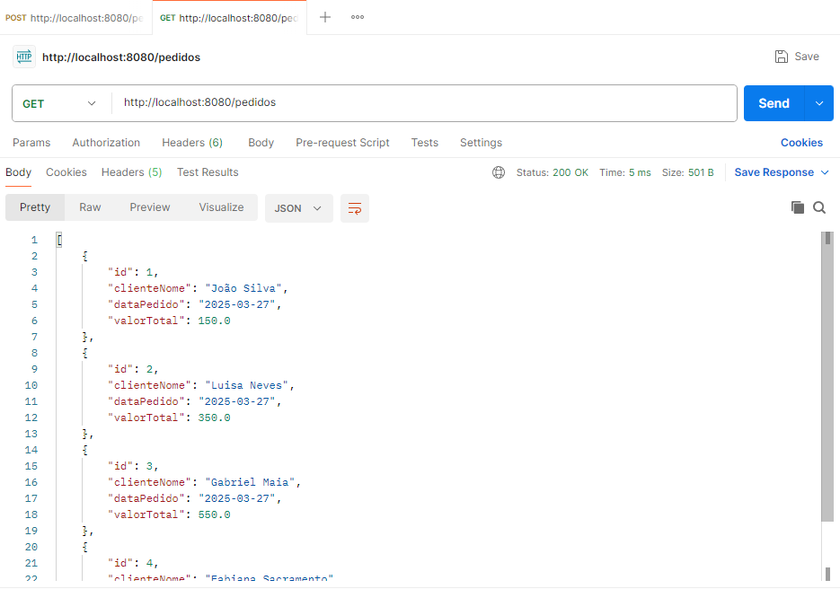
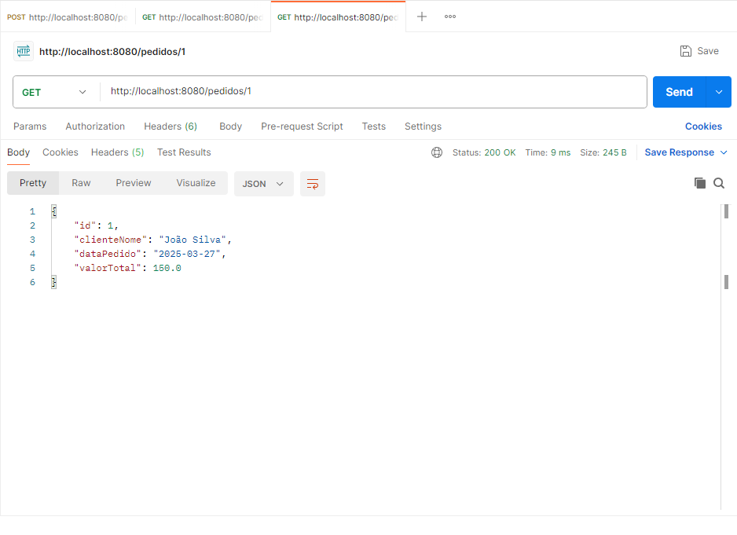
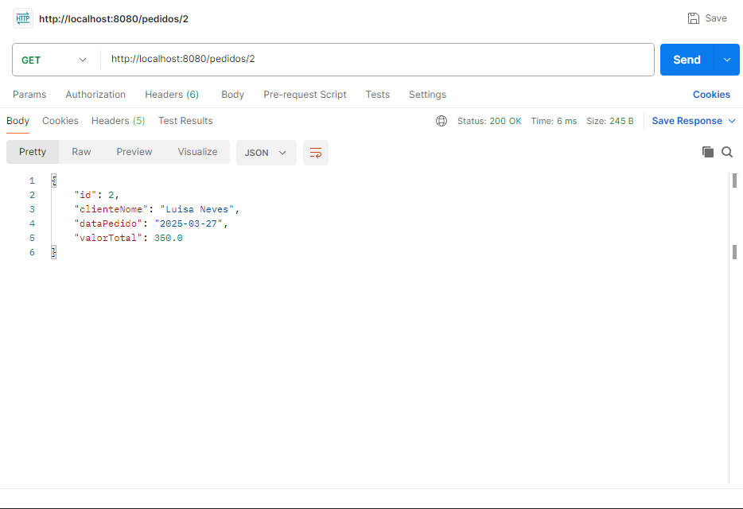
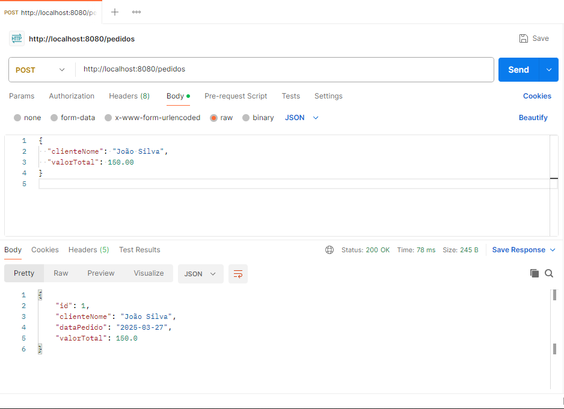
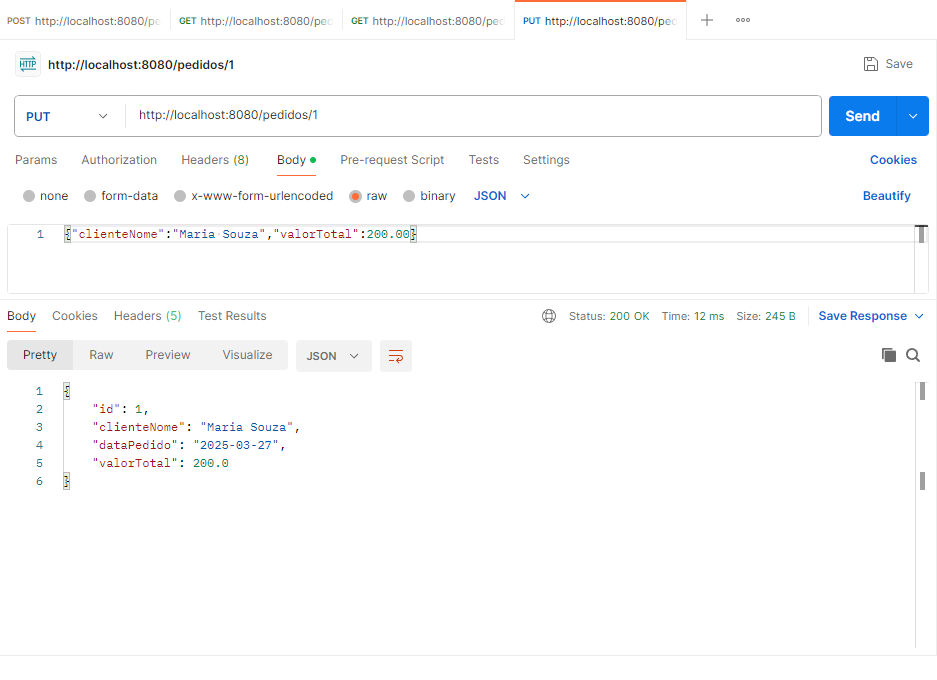
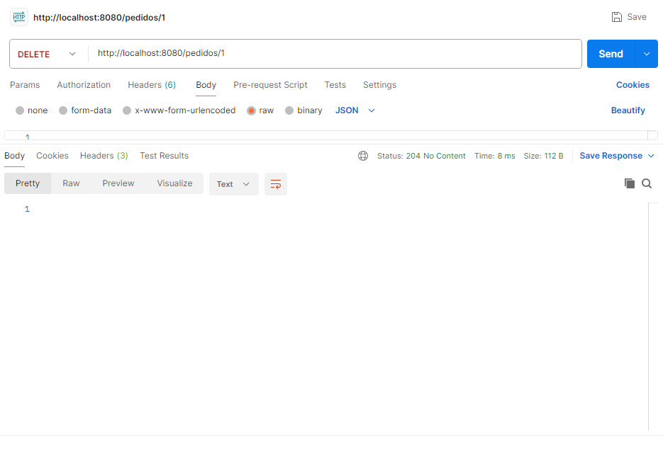
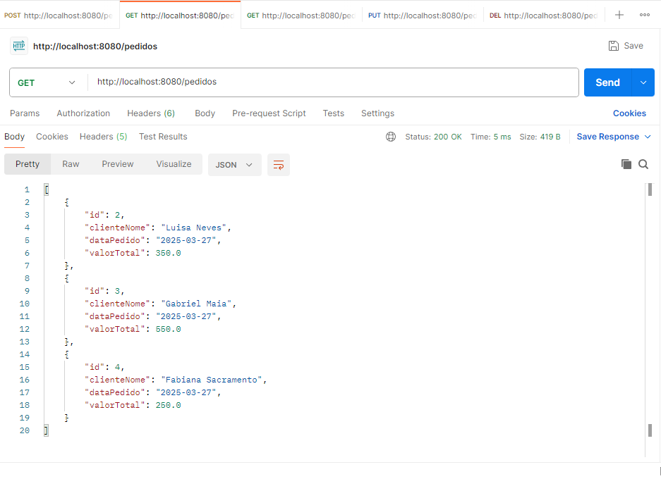
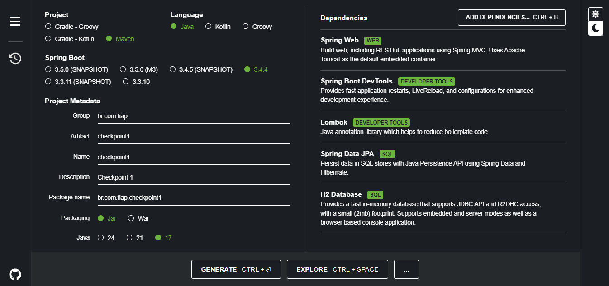
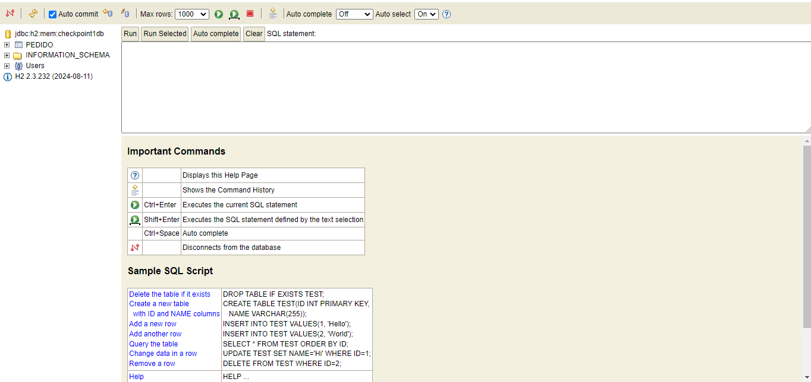
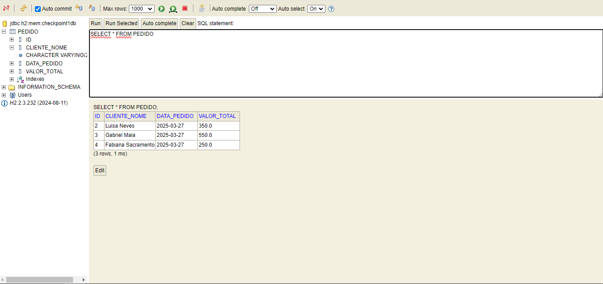

# API de Pedidos - Checkpoint 1

Esta API permite gerenciar pedidos através de operações CRUD.

## 📌 Endpoints

- `GET /pedidos` → Lista todos os pedidos.

- `GET /pedidos/{id}` → Busca um pedido pelo ID.

- `POST /pedidos` → Cria um novo pedido.

- `PUT /pedidos/{id}` → Atualiza um pedido existente.
Pedido 1 alterado.

- `DELETE /pedidos/{id}` → Remove um pedido.

pedido 1 não exixte mais

## Spring Initializr

- Java 17
- Spring Boot 3.1.*
- H2 Database

# H2 conectado 

## Resultado final do H2
